# Контейнеризация (семинары)

## Урок 2. Механизмы контрольных групп

**<u>Задание:</u>** 
1. Запустить контейнер с Ubuntu, используя механизм LXC
2. Ограничить контейнер 256 Мб ОЗУ и проверить, что ограничение работает
3. По желанию
4. Добавить автозапуск контейнеру, перезагрузить ОС и убедиться, что контейнер действительно запустился самостоятельн
5. При создании указать файл, куда записывать логи
6. После перезагрузки проанализировать логи

***LXC** (Linux Containers) - это технология виртуализации на уровне операционной системы Linux, которая позволяет создавать изолированные контейнеры, в которых могут работать приложения и процессы. Каждый контейнер имеет свои собственные файловые системы, сетевые интерфейсы, процессы и пользователи, но все они используют одно ядро операционной системы.*

***LXD** (Linux Container Daemon) - это менеджер контейнеров, который предоставляет более высокий уровень абстракции над LXC. Он упрощает создание и управление контейнерами, позволяет создавать и использовать образы контейнеров, поддерживает сетевую изоляцию и многое другое. LXD также предоставляет API для управления контейнерами, что позволяет интегрировать его в другие инструменты и автоматизировать процессы управления контейнерами.*

<u>Все действия будем выполнять с правами суперпользователя (sudo -s).</u>

Установим необходимые пакеты с помощью пакетного менеджера + набор тэмплейтов (заготовок образов операционных систем):
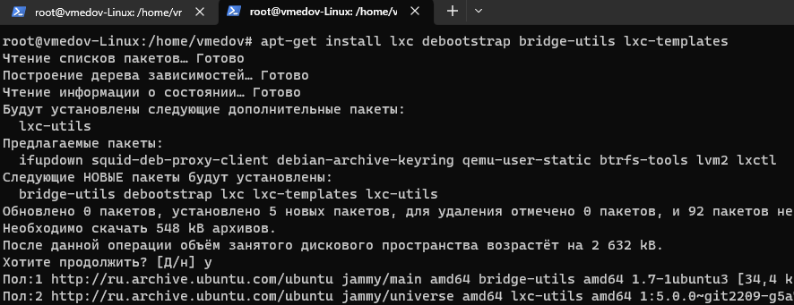

Установим инструмент LXD Installer для установки и настройки LXD на сервере.:
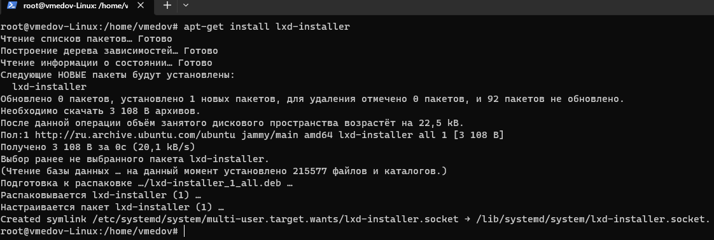

Запускаем процесс настройки LXD:
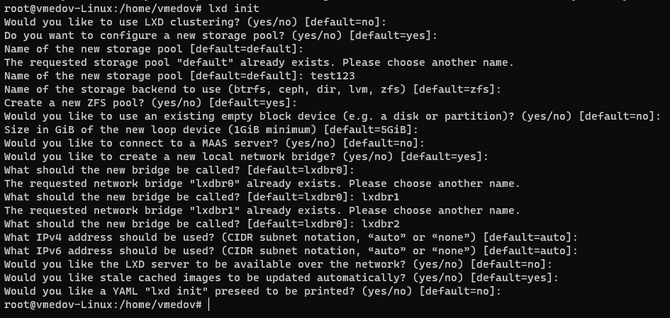

Выведем список доступных хранилищ LXD на сервере.:
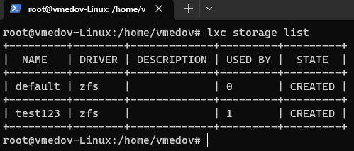

Создаем новый контейнер с именем "test01" на базе образа Ubuntu:
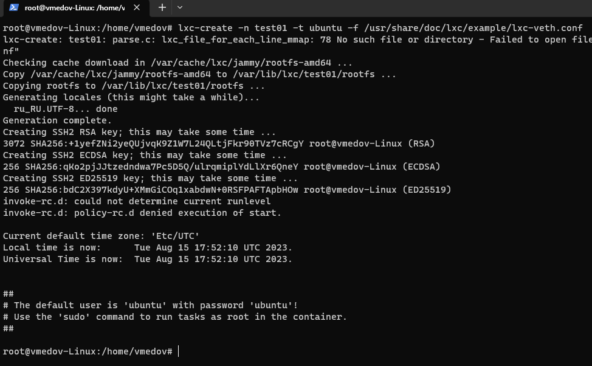

Запускаем контейнер в режиме демона(фоновый режим(флаг -d)) и подключаемся к нему:
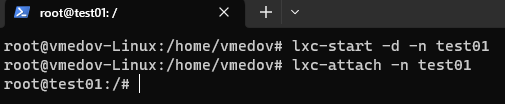

Уточним текущий размер оперативной памяти, выделенной для  контейнера test01 системой:
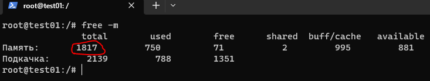

Для изменения размера выделенной контейнеру памяти ОЗУ, выходим из контейнера(exit), заходим в конфигурационный файл и добавляем строку с ограничением памяти(256Мб):
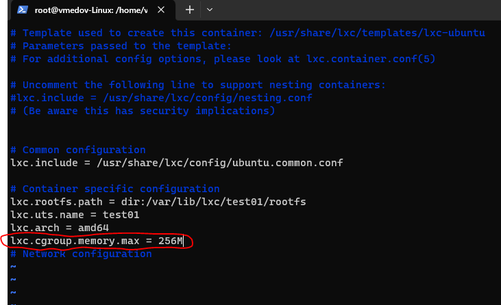

Перезагрузим контейнер: остановка(stop), запуск(start), подключение(attach)
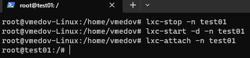

Посмотрим список всех контейнеров, установленных на хост-системе:
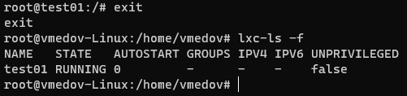

Откроем конфигурационный файл контейнера "test01" для редактирования и укажем настройку, которая будет запускать контейнер автоматически при старте хост-системы:
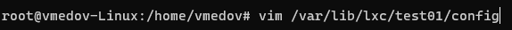
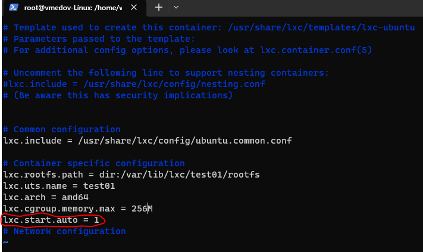

Остановим контейнер test01: команда *lxc-stop -n test01*
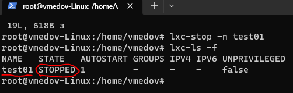

Перезагрузим хост-систему и убедимся, что контейнер запустился автоматически:
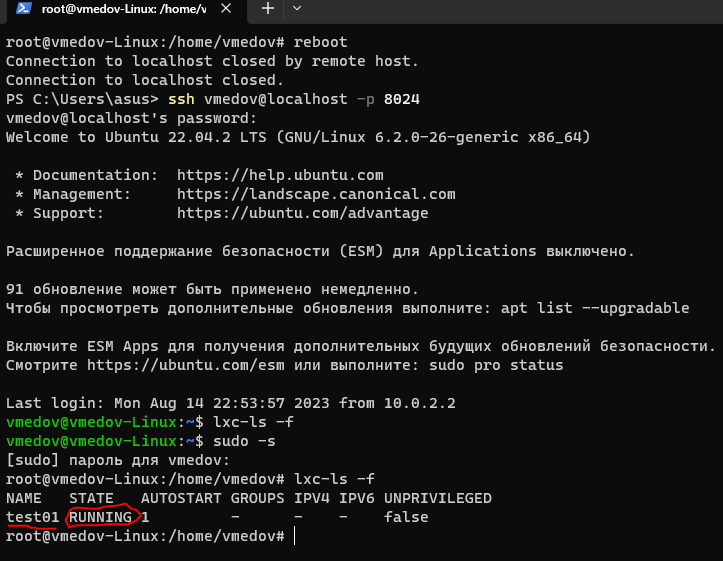

Для удаления контейнера test01 с хост-системы используется команда:  *lxc-destroy -n test01*