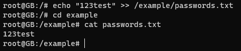
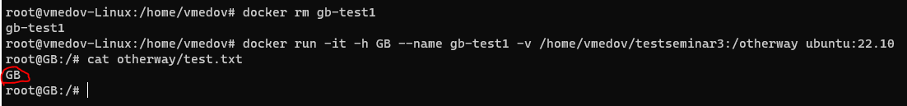
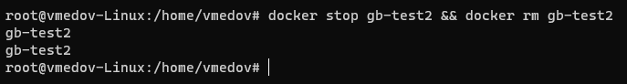

# Контейнеризация (семинары)

## Урок 3. Введение в Docker

**<u>1. Установим Докер</u>** 

Обновим списки пакетов:
> apt update

Установим пакеты, которые позволят использовать репозиторий по HTTPS:
> apt install apt-transport-https ca-certificates curl software-properties-common

Добавим официальный GPG-ключ Docker:
> curl -fsSL https://download.docker.com/linux/ubuntu/gpg | sudo gpg --dearmor -o /usr/share/keyrings/docker-archive-keyring.gpg

Добавим репозиторий Docker к списку источников пакетов:
> echo "deb [signed-by=/usr/share/keyrings/docker-archive-keyring.gpg] https://download.docker.com/linux/ubuntu $(lsb_release -cs) stable" | sudo tee /etc/apt/sources.list.d/docker.list > /dev/null

Обновим список пакетов, чтобы включить информацию о пакетах Docker из добавленного репозитория:
> apt update

Установим Docker:
> apt install docker-ce

Добавим текущего пользователя в группу docker, чтобы исключить использование sudo при запуске команд Docker:
> sudo usermod -aG docker $USER

Перезагрузим группы пользователя, чтобы изменения в группе docker вступили в силу:
> newgrp docker

Теперь мы готовы использовать Docker через терминал. Для этого проверим его работу, выполнив команду:
> docker --version

**<u>2. Протестируем работу Докер</u>** 

Запустим Docker:
> sudo systemctl start docker

Запустим контейнер, используя образ "cowsay":
> docker run docker/whalesay cowsay Hello, Docker!

<u>Теперь запустим контейнеры с различными рисунками животных с использованием cowsay. Мы можем заменить текст "Hello, Docker!" на любой другой текст, который захотим, чтобы животное "сказало". Таким образом, мы сможем не только визуально проверить работу Docker, но и весело провести время!</u>

Запустим контейнер с рисунком слона:
> docker run docker/whalesay cowsay -f elephant "Hello, Vladimir Medov!"

Запустим контейнер с рисунком пингвина:
>  docker run docker/whalesay cowsay -f tux "Hello, Vladimir Medov!"

Запустим контейнер с рисунком дракона:
> docker run docker/whalesay cowsay -f dragon "Hello, Vladimir Medov!"

Запустим контейнер с рисунком кенгуру:
> docker run docker/whalesay cowsay -f kangaroo "Hello, Vladimir Medov!"

Запустим контейнер с рисунком утки:
> docker run docker/whalesay cowsay -f duck "Hello, Vladimir Medov!"

Запустим контейнер с рисунком панды:
> docker run docker/whalesay cowsay -f panda "Hello, Vladimir Medov!"

Запустим контейнер с рисунком совы:
> docker run docker/whalesay cowsay -f owl "Hello, Vladimir Medov!"

Запустим контейнер с рисунком кота:
> docker run docker/whalesay cowsay -f kitty "Hello, Vladimir Medov!"

**<u>3. Команды Докер</u>** 

Создание и запуск контейнеров:

**docker run** - запускает контейнер из образа.\
**docker start** - запускает остановленный контейнер.\
**docker stop** -  останавливает работающий контейнер.\
**docker restart** - перезапускает контейнер.\
**docker exec** -  выполняет команду внутри запущенного контейнера.

Управление контейнерами:

**docker rm $(docker ps -aq)** - удалит все остановленные контейнеры.\
**docker ps** - просмотр списка запущенных контейнеров.\
**docker ps -a** - просмотр списка всех контейнеров (включая остановленные). 
**docker rm** - удаляет контейнер. 
**docker logs** - просмотр логов контейнера.

Работа с образами:

**docker images** - просмотр списка образов.\
**docker pull** - загрузка образа с Docker Hub. 
**docker build** - сборка образа из Dockerfile.\
**docker rmi** - удаляет образ.

**<u>4. Хранение данных в контейнерах Docker: Руководство с пояснениями</u>** 
Часть -1

**<u>Цель:</u>** разберемся с тем, как можно хранить данные в контейнерах. Это критически важно для инженеров, работающих с Docker, так как хранение данных - ключевой аспект работы.

Запустим контейнер из образа Ubuntu и войдем в него:
> docker run -it -h GB --name gb-test ubuntu:22.10

Посмотрим содержимое корневой директории:
> ls -l /

Создадим новую директорию в корне:
> mkdir /example

В каталоге example создадим файл "passwords.txt":
> touch /example/passwords.txt

Добавим в файл "passwords.txt" какие-либо данные:
> echo "123test" >> /example/passwords.txt

Просмотрим содержимое файла passwords.txt:
> cat passwords.txt

Попробуем остановить контейнер и затем запустить его снова. Сохранятся ли наши данные?:
> exit\
> docker stop gb-test\
> docker start gb-test\
> docker exec -it gb-test bash\
> cat /example/passwords.txt

<u>Результат:</u>  данные сохранились, так как мы не пересоздавали контейнер.

Удалим контейнер и создадим его заново, используя те же команды. Сохранятся ли теперь наши данные?:
> exit\
> docker stop gb-test\
> docker rm gb-test\
> docker run -it -h GB --name gb-test ubuntu:22.10

<u>Результат:</u>  данные не сохранились, так как контейнер был удален и создан заново.

Рассмотрим наиболее интересный вариант для сохранения данных - использование внешнего хранилища. Создадим директорию и подмонтируем ее к контейнеру:
> mkdir testseminar3\
> docker run -it -h GB --name gb-test1 -v /home/vmedov/testseminar3:/otherway ubuntu:22.10

Добавим данные в подмонтированную директорию:
> echo "$HOSTNAME" >> /otherway/test.txt

Просмотрим содержимое файла test.txt в контейнере:
> cat otherway/test.txt

Проверим доступность данных с локальной системы:
> exit\
> cat testseminar3/test.txt

Удалим контейнер и создадим его снова, подмонтировав директорию:
> docker rm gb-test1\
>  docker run -it -h GB --name gb-test1 -v /home/vmedov/testseminar3:/otherway ubuntu:22.10

Просмотрим содержимое файла test.txt в контейнере:
> cat otherway/test.txt

<u>Результат:</u> мы видим, что данные по-прежнему доступны.

**Заключение:**\
<u>Самый надежный способ хранения данных в контейнерах - использование внешних хранилищ. Важно избегать хранения важных данных внутри контейнеров, чтобы предотвратить потерю информации.</u>

**<u>4. Хранение данных в контейнерах Docker: Практическое руководство.</u>**\
Часть -2

Создадим папку, которую мы будем готовы смонтировать в контейнер:
> mkdir ~/docker-mount-example

В этой папке создадим файл test.txt и наполним его данными:
> echo "This is the host test.txt file" > ~/docker-mount-example/test.txt

В домашней директории создаем файл test.txt, который также понадобится для монтирования в контейнер, но с другим содержимым:
> echo "This is the root test.txt file" > ~/test.txt

Создаем контейнер из образа ubuntu:22.10 и задаем ему имя и hostname:
> docker run -it -h GB --name gb-test2 ubuntu:22.10

Выходим из контейнера, останавливаем и удаляем контейнер:
> exit\
> docker stop gb-test && docker rm gb-test

Создаем контейнер из образа ubuntu:22.10, задаем ему имя и hostname и монтируем ранее созданную папку с хоста в контейнер:
> docker run -it -h GB --name gb-test2 -v ~/docker-mount-example:/container-mount -v ~/test.txt:/container-mount/test.txt ubuntu:22.10

Смотрим содержимое текстового файла в контейнере:
> cat /container-mount/test.txt

Останавливаем и удаляем контейнер:
> docker stop gb-test2 && docker rm gb-test2

Создаем контейнер из образа ubuntu:22.10, задаем ему имя и hostname и монтируем созданный ранее текстовый файл из домашней директории внутрь смонтированной папки в контейнере:
> docker run -it -h GB --name gb-test2 -v ~/docker-mount-example:/container-mount -v ~/test.txt:/container-mount/test.txt ubuntu:22.10

Смотрим содержимое текстового файла в контейнере:
> cat /container-mount/test.txt

Мы создали контейнер и монтировали папку docker-mount-example внутрь контейнера. Затем мы монтировали файл test.txt из домашней директории внутрь этой папки в контейнере. При просмотре содержимого файла в контейнере, вы увидите данные из файла в домашней директории.