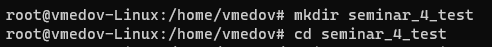
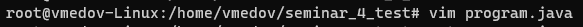
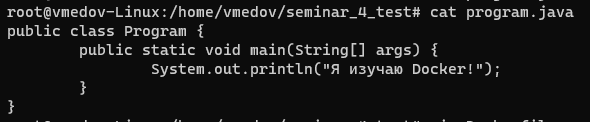
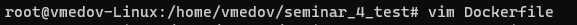
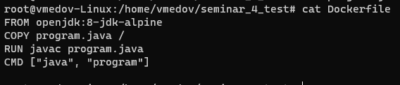
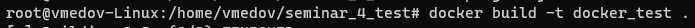
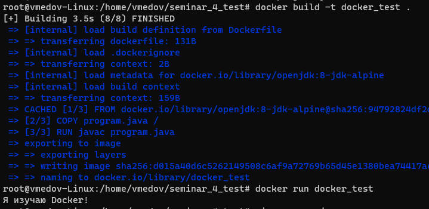

# Контейнеризация (семинары)

## Урок 4. Dockerfile и слои

**<u>Задание:</u>**  необходимо создать Dockerfile, основанный на любом образе (вы в праве выбрать самостоятельно).
В него необходимо поместить приложение, написанное на любом известном вам языке программирования (Python, Java, C, С#, C++).
При запуске контейнера должно запускаться самостоятельно написанное приложение.

**<u>Последовательность решения задачи:</u>** 
 
Создал директорию:

В редакторе vim написал простенькую программу на языке java:

Написал инструкцию в Dockerfile:

Собрал Dockerfile:

Запустил программу из контейнера:

