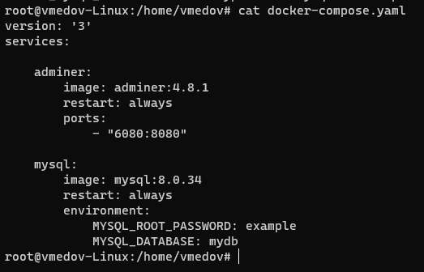
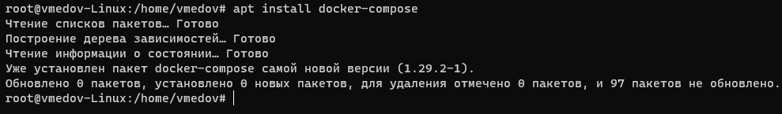
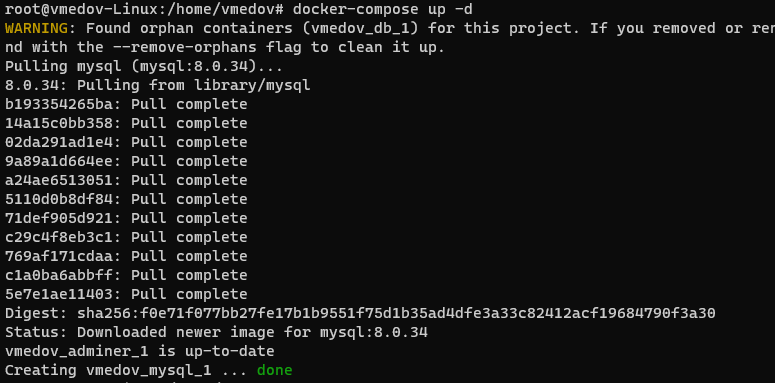
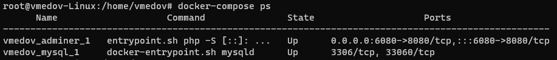
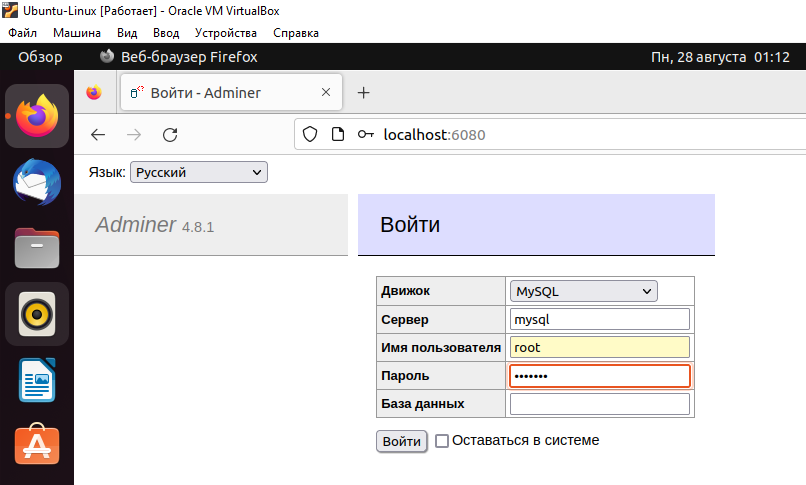
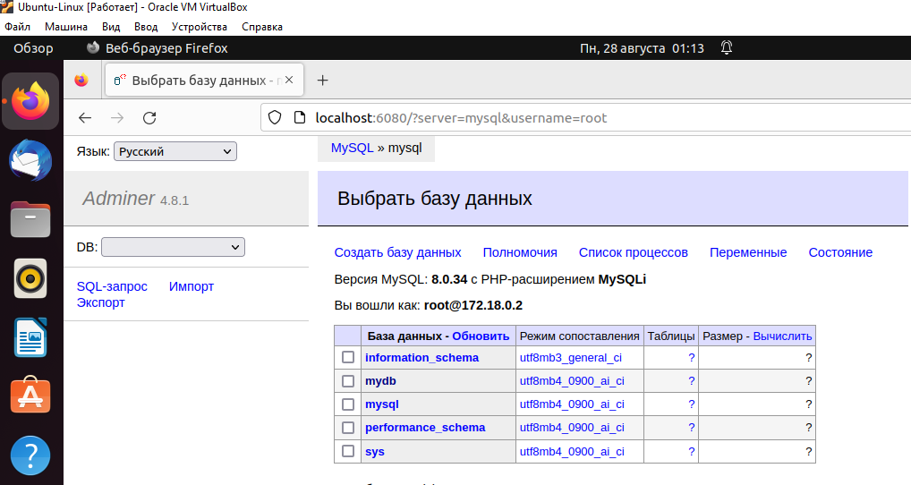

# Контейнеризация (семинары)

## Урок 5. Docker Compose и Docker Swarm

**<u>Задание:</u>**  создать сервис, состоящий из 2 различных контейнеров: 1 - веб, 2 - БД (compose).

1. Создадим файл docker-compose.yaml и пропишем в него сервисы:

    vim docker-compose.yaml

2. Устанавим docker-compose, если его нет:

    apt install docker-compose

3. Запустим наш проект в фоновом режиме:

    docker-compose up -d

4. Выведемм на экран все доступные контейнеры:

    docker-compose ps

5. Проверим работу проекта в браузере, перейдя по адресу:

    http://localhost:6080/

